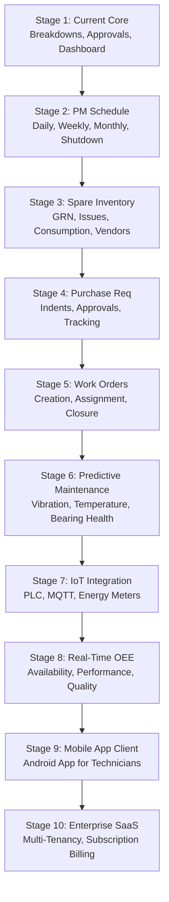

# Industrial CMMS Evolution Roadmap

This document outlines the 10-stage roadmap for scaling the CMMS from its current breakdown reporting roots to a predictive, IoT-connected, multi-tenant enterprise SaaS platform.

---

## 1. 10-Stage Evolution Roadmap



### Stage 1: Current System
* **Scope**: Core breakdown entry logs, supervisor review/approval pipelines, and OEE dashboard calculation reports.
* **Objective**: Replicate legacy GAS functionality with a robust Express + PostgreSQL API and React SPA.

### Stage 2: Preventive Maintenance (PM)
* **Scope**: PM schedules definitions, checklist templates (Daily, Weekly, Monthly, Shutdown lists), and calendar due dates tracking.
* **Objective**: Minimize breakdown counts via systematic schedule warnings and execution audits.

### Stage 3: Spare Parts Inventory Management
* **Scope**: Goods Received Note (GRN), inventory counts, issue logs, stock consumption mapping to breakdown numbers, and vendor registries.
* **Objective**: Real-time spare parts availability mapping and cost-of-maintenance calculations.

### Stage 4: Purchase Requisitions
* **Scope**: Low-stock alerts, purchase indents creation, supervisor/manager approval queues, and purchase order tracking.
* **Objective**: Eliminate stock-out delays for critical machinery spares.

### Stage 5: Work Orders (WO)
* **Scope**: Reactive and preventative work orders, manual/automatic assignment, technician checklists, and digital closure signatures.
* **Objective**: Standardize maintenance procedures and measure individual technician efficiency (MTTR per technician).

### Stage 6: Predictive Maintenance (PdM)
* **Scope**: Sensor integration for machinery diagnostics (vibration analysis, temperature monitoring, motor current signatures, bearing acoustic metrics).
* **Objective**: Predict machine breakdowns before failure events trigger.

### Stage 7: IoT & Edge Integration
* **Scope**: Edge gateway integration communicating via MQTT protocol with PLCs, energy meters, and machine stroke/rpm counters.
* **Objective**: Automatic capture of machinery active/idle cycles and exact power consumption patterns.

### Stage 8: Real-Time OEE Calculations
* **Scope**: Automated OEE dashboard calculating real-time Availability, Performance (speed loss), and Quality (rejections count).
* **Objective**: Shift from batch KPI calculations to a live line production monitoring board.

### Stage 9: Native Mobile Application
* **Scope**: Offline-capable React Native Android app for technicians to create breakdown logs, snap machine defect photos, scan QR codes, and receive notifications.
* **Objective**: Empower factory floor engineers with live diagnostics.

### Stage 10: Enterprise SaaS Platform
* **Scope**: Multi-company tenant isolation (rls policies), subscription billing gateway, localized notifications engine, and AI-driven lifecycle predictions.
* **Objective**: Run a commercial multi-tenant CMMS software-as-a-service.

---

## 2. Mobile App UX & Screen Navigation Flow

```text
+-------------------------------------------------------+
|                   Technician Login                    |
+-------------------------------------------------------+
|  [Email]                                              |
|  [Password]                                           |
|                                                       |
|                     [ LOGIN ]                         |
+-------------------------------------------------------+
                            │
                            ▼
+-------------------------------------------------------+
|                    Home Dashboard                     |
+-------------------------------------------------------+
|  ( ) Breakdown Entry        ( ) My History            |
|  ( ) Notifications          ( ) Profile               |
+-------------------------------------------------------+
                            │
                            ▼
+-------------------------------------------------------+
|                 Breakdown Entry Form                  |
+-------------------------------------------------------+
|  [ Machine Category v ]                               |
|  [ Machine ID / Name v ]                              |
|  [ Problem Type (Mechanical/Electrical...) v ]        |
|  [ Description: text area ]                           |
|  [ Start Time: Picker ]                               |
|                                                       |
|  [ Add Defect Photo ]  --> (Camera/Gallery Access)     |
|                                                       |
|                     [ SUBMIT ]                        |
+-------------------------------------------------------+
```

### Role-Based Screen Hierarchies:

#### 1. Supervisor Dashboard & Actions
* **Pending Approvals Queue**: Lists incoming logs needing audit (badge count indicator).
* **Approval Form**: Review log details, fill in root cause / action taken notes, and click `Approve` or `Reject`.
* **Summary Dashboard**: Active breakdown counts, department OEE, and active technicians tracking.

#### 2. Manager Reports Panel
* **MTTR / MTBF Chart**: Monthly visual trends.
* **Availability Metrics**: Individual machine and plant-level uptime percentage tables.
* **Data Export**: Triggers OEE / historical reports downloads as CSV format.

#### 3. System Administrator Panel
* **User Management**: Add/edit/delete staff accounts, assign levels/roles.
* **Machine Registry**: Configure new machinery, specify sub-assembly parts.
* **System Masters**: Edit dropdown options for shift hours, problem categories, and OEE targets.
* **Configurations**: Set SMTP keys, API base paths, and DB purge schedules.
