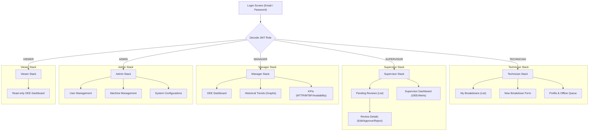
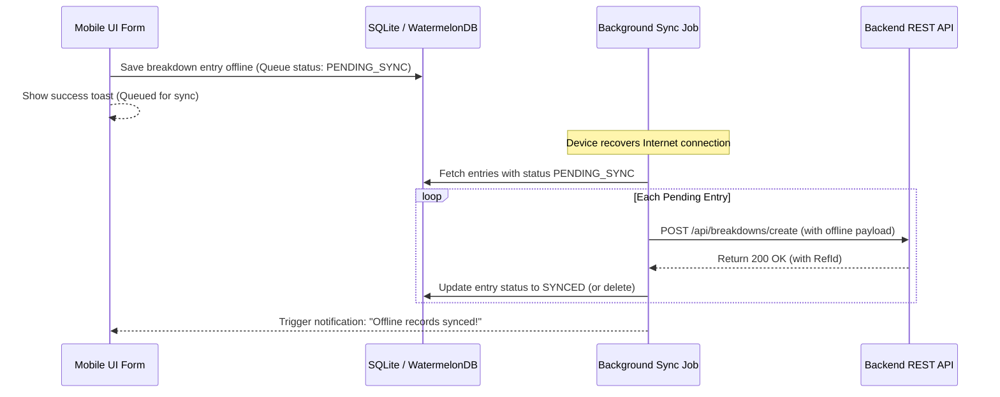

# Mobile Architecture Design - React Native CMMS

This document outlines the mobile-ready architecture for the Parksons Packaging CMMS mobile client, designed using React Native (Expo) and TypeScript.

---

## 1. Screen Hierarchy & User App Flow

The application uses **React Navigation** (specifically Expo Router) with a root Drawer navigation containing tabs based on user roles. The UI dynamically shows/hides navigation routes depending on the decoded role in the JWT token.



---

## 2. Role Permissions Mapping

The mobile client enforces role permissions locally by rendering screens conditionally, and the backend middleware enforces them at the API layer:

| Role | Permitted Actions | Visible Mobile Screens |
| :--- | :--- | :--- |
| **Technician** | Create breakdown logs, view own logged breakdowns. | My Breakdowns, Log Breakdown, Profile. |
| **Supervisor** | Inline edit pending logs, Approve/Reject logs, View supervisor dashboard. | Pending Queue, Review Log, Status Dashboard. |
| **Manager** | View all reports, OEE statistics, KPI calculations, Historical trend graphs. | Manager Dashboard, KPIs, Historical Reports. |
| **Admin** | Manage users, machines, masters, configurations. Full CRUD permissions. | Users Admin, Machine Admin, Configs Settings. |
| **Viewer** | Read-only view of dashboard OEE charts. | Read-Only Dashboard. |

---

## 3. JWT Authentication & Session Flow

1. **Secure Storage**: On successful login, the JWT access token is stored on the device using `expo-secure-store` (iOS Keychain / Android Keystore).
2. **Auth Header**: Axios interceptors append `Authorization: Bearer <token>` to all HTTP requests.
3. **Session Recovery**: On app launch, the app attempts to read the token. If valid, the user bypasses the login screen.
4. **Token Expiry**: On a `401 Unauthorized` API response, the app deletes the stored token and routes the user back to the Login Screen with a session expired notice.

---

## 4. Mobile API Endpoints Schema

The mobile client interacts with the following backend REST API surface:

### Authentication
* `POST /api/auth/login`: `{ email, password }` -> Returns `{ success, data: { token, user: { name, email, level } } }`

### Breakdowns
* `GET /api/breakdowns/pending`: Fetches pending breakdowns for supervisors.
* `POST /api/breakdowns/create`: `{ date, shift, machineType, machineName, unit, problemType, category, description, timeStart, timeEnd, durationMin, attendedBy, remarks }`
* `PUT /api/breakdowns/update`: Updates breakdown details prior to approval.
* `PUT /api/breakdowns/status`: Sets custom status flags.

### Approvals
* `POST /api/approvals/approve`: `{ refId, actionTaken, rootCause }`
* `POST /api/approvals/reject`: `{ refId, remarks }`

### Masters & Reports
* `GET /api/machines`: Cascading hierarchy metadata (Machines + Units).
* `GET /api/reports/dashboard`: Monthly dashboard OEE data.
* `GET /api/reports/kpi`: Metric computations (MTTR, MTBF, Availability).

---

## 5. Offline Support & Sync Strategy

Since factories may have areas with poor Wi-Fi coverage, the mobile app includes an **Offline-First Storage Engine** using **WatermelonDB** or **SQLite**:



### Sync Mechanisms:
* **Local Database Cache**: Master machine lists and technician lists are saved locally. They are refreshed once daily or manually via a pull-to-refresh action.
* **Offline Queue**: Created logs are stored locally with an auto-incremented temporary ID and state `PENDING_SYNC`.
* **Sync Monitor**: Uses React Native `NetInfo` to watch network state. When connection changes from offline to online, a background sync is queued.
* **Conflict Resolution**: The backend acts as the single source of truth. If a record fails to sync due to duplicate validation (e.g. RefId already synced), it is marked as `SYNC_CONFLICT` and highlighted in the sync queue screen for manual resolution.

---

## 6. Push Notifications Architecture

Used to alert supervisors of new breakdowns, and notify technicians when a PM schedule is assigned or when their logged breakdown has been approved or rejected.

* **Provider**: Firebase Cloud Messaging (FCM) for Android, APNs for iOS, orchestrated via **Expo Notification Service**.
* **Flow**:
  1. On login, the mobile app registers the device token:
     `POST /api/users/register-device-token` with `{ email, deviceToken, os }`.
  2. When a technician creates a breakdown, the backend triggers a hook:
     * Queries database for supervisors.
     * Dispatches notification via FCM:
       ```json
       {
         "to": "<Supervisor_FCM_Token>",
         "notification": {
           "title": "New Breakdown Alert",
           "body": "Machine PrintKBA1 reported down by Shivaji.",
           "sound": "default"
         },
         "data": {
           "click_action": "FLUTTER_NOTIFICATION_CLICK",
           "type": "NEW_BREAKDOWN",
           "refId": "PKS-20260621-120000"
         }
       }
       ```
  3. When clicked on the device, the app navigates directly to the review screen for `refId` specified.
