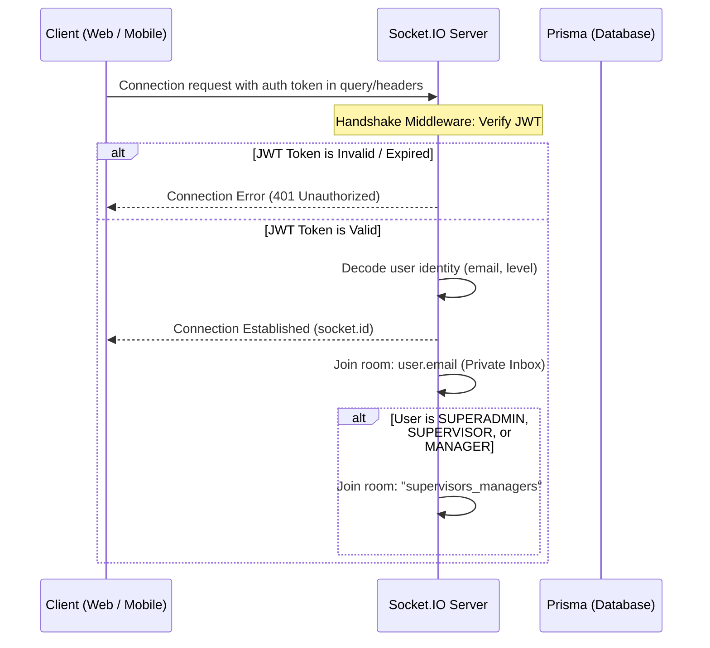

# Socket.IO Real-Time Notifications Architecture

This document specifies the Socket.IO system design for pushing instant maintenance alerts and approval workflow updates to supervisors, managers, and technicians.

---

## 1. Socket Connection & Authentication Flow

To secure WebSocket connections, Socket.IO handshakes are authenticated using the same JWT credentials as the REST APIs.



### Handshake Authentication Implementation:
```typescript
io.use((socket, next) => {
  const token = socket.handshake.auth.token || socket.handshake.query.token;
  if (!token) {
    return next(new Error('Authentication error: Token missing'));
  }
  
  jwt.verify(token, JWT_SECRET, (err, decoded) => {
    if (err) return next(new Error('Authentication error: Invalid token'));
    socket.data.user = decoded; // Attach user info to socket
    next();
  });
});
```

---

## 2. Event Directory & Payloads

The system broadcasts three primary real-time event signatures:

### A) Event: `breakdown_created`
* **Trigger**: A technician submits a new breakdown entry.
* **Target Audience**: All active supervisors and managers (`supervisors_managers` room).
* **Payload Structure**:
  ```json
  {
    "eventId": "evt_bc_89231",
    "timestamp": "2026-06-21T07:08:00Z",
    "refId": "PKS-20260621-120000",
    "machineName": "PrintKBA1",
    "unit": "Feeder",
    "description": "Feeder proximity sensor malfunction.",
    "submittedBy": "Shivaji",
    "status": "PENDING_REVIEW"
  }
  ```

### B) Event: `breakdown_approved`
* **Trigger**: A supervisor reviews and approves a logged breakdown.
* **Target Audience**: The specific technician who logged the breakdown (Private Room matching `submittedBy` email).
* **Payload Structure**:
  ```json
  {
    "eventId": "evt_ba_91230",
    "timestamp": "2026-06-21T07:15:22Z",
    "refId": "PKS-20260621-120000",
    "machineName": "PrintKBA1",
    "approvedBy": "YogeshK",
    "status": "APPROVED"
  }
  ```

### C) Event: `breakdown_rejected`
* **Trigger**: A supervisor rejects a logged breakdown.
* **Target Audience**: The specific technician who logged the breakdown (Private Room matching `submittedBy` email).
* **Payload Structure**:
  ```json
  {
    "eventId": "evt_br_45620",
    "timestamp": "2026-06-21T07:16:11Z",
    "refId": "PKS-20260621-120000",
    "machineName": "PrintKBA1",
    "rejectedBy": "YogeshK",
    "remarks": "Incomplete description. Please update with correct serial number.",
    "status": "REJECTED"
  }
  ```

---

## 3. Room Segmentation & Logic

To prevent message leaking, users are dynamically segmented into target rooms on connection:

1. **Private User Room**: `user:${email}`
   - Every connected user joins a room unique to their email. Used for direct technician feedback alerts (`breakdown_approved` / `breakdown_rejected`).
2. **Supervisor/Manager Broadcast Room**: `supervisors_managers`
   - Any user whose role is `superadmin`, `supervisor`, or `manager` joins this room. Used to broadcast `breakdown_created` events.

---

## 4. Frontend Notification Badge UI Flow

1. **State Store**: The web/mobile app maintains a state array: `notifications: Array<{ refId, message, read: boolean }>` and a numeric count `unreadCount: number`.
2. **Socket Hook**:
   ```typescript
   socket.on('breakdown_created', (data) => {
     addNotification({
       refId: data.refId,
       message: `New breakdown reported: ${data.machineName} - ${data.description}`,
       read: false
     });
     showBannerAlert(`New breakdown at ${data.machineName}!`);
   });
   ```
3. **Badge UI Indicator**:
   - The navigation header displays a bell icon.
   - If `unreadCount > 0`, a red circular badge with the count is overlaid.
   - Clicking the bell opens a dropdown menu showing the last 5 alerts.
   - Selecting an alert routes the supervisor directly to the pending approval screen for that `refId` and sets the notification as read, decrementing the unread badge count.
